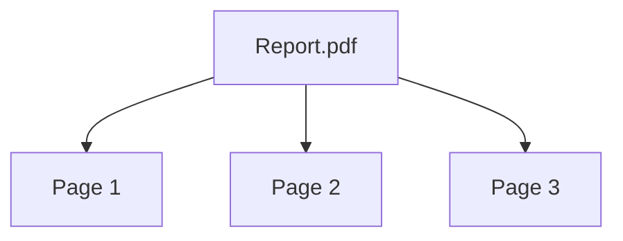
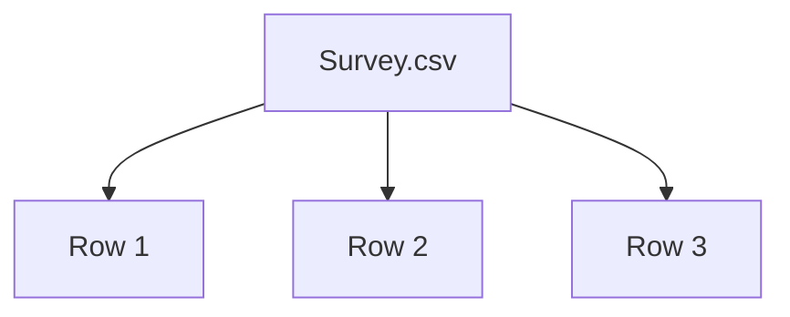

Assets are composable - they have parent-child relationships. A CSV is one file, but it's also individual rows you can analyze separately. A PDF is one document, but it's also pages. Most data you'd want to work with - mbox archives, article feeds, survey exports - can be broken down this way.

<CardGroup cols={2}>
  <Card title="PDF" icon="file-pdf">

  </Card>
  <Card title="CSV" icon="table">

  </Card>
</CardGroup>

If an adapter for your format doesn't exist yet, it's straightforward to build one.

## Formats & Uploading

<CardGroup cols={2}>
  <Card title="PDF" icon="file-pdf" color="#E53935" horizontal>
    The main asset is the PDF with metadata and text content. The pages are sub-assets.
  </Card>
  <Card title="CSV" icon="table" color="#43A047" horizontal>
    CSV Parent + Rows as sub-assets
  </Card>
  <Card title="Articles" icon="image" color="#FFC107" horizontal>
    Complex content, like articles with images and links. Soon with our own compositor for writing.
  </Card>
  <Card title="Web/RSS" icon="globe" color="#1E88E5" horizontal>
    Scraped websources with metadata as Articles
  </Card>
  <Card title="Text/ Markdown" icon="file-lines" color="#8E24AA" horizontal>
    Simplest Asset
  </Card>
  <Card title="Images" icon="image" color="#FFC107" horizontal>
    Images in PNG & JPG.
  </Card>
</CardGroup>

<video controls width="100%">
  <source src="/images/upload-view.mp4" type="video/mp4" />
</video>

## Streaming Sources

Many sources stream data continuously. Set up ongoing discovery and ingestion from:

<CardGroup cols={2}>
  <Card title="Web Search" icon="magnifying-glass" color="#1E88E5" horizontal>
    Tavily, SearXNG, and other search APIs
  </Card>
  <Card title="RSS Feeds" icon="rss" color="#FF9800" horizontal>
    RSS & RSS-style XML feeds
  </Card>
  <Card title="Site Discovery" icon="spider-web" color="#8E24AA" horizontal>
    Scrape all items from a page (e.g. cnn.com/economy)
  </Card>
  <Card title="URL Lists" icon="list" color="#43A047" horizontal>
    Ingest URLs, detect changes on refresh
  </Card>
</CardGroup>

## Bundles

Bundles organize your assets. Think folders, but an asset can live in multiple bundles without duplicating.

<CardGroup cols={2}>
  <Card title="By Project" icon="folder">
    "Climate Policy Research", "Election Coverage 2024", "Grant Applications Q1"
  </Card>
  <Card title="By Source" icon="newspaper">
    "Government Documents", "News Articles", "Academic Papers"
  </Card>
</CardGroup>

Bundles can nest. Assets can belong to several at once. When you run analysis, you pick which bundles to include.
