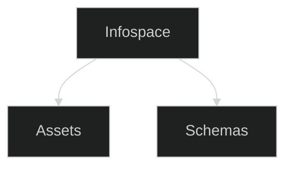
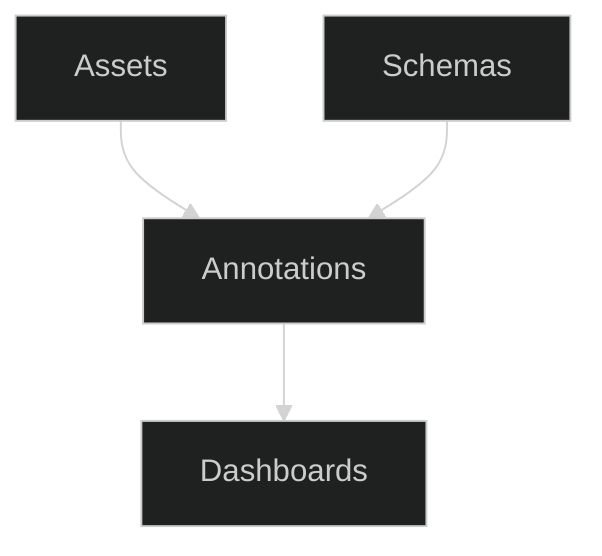
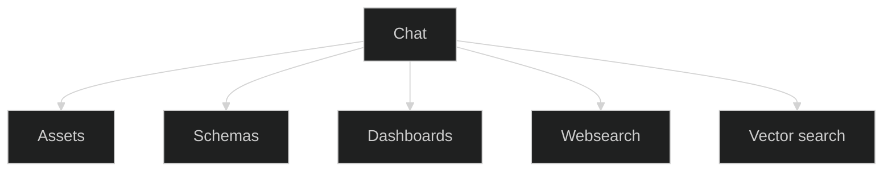

We aim to provide few but powerful core concepts to allow for flexible data ingestion, analysis and management.
Foundation services like AI Models, a Geocoder or a Websearch tool can extend the functionality and allow for hybrid setups. From cloud to fully local on your own hardware.

<Note>Before you start: make sure your providers for the foundation services are properly installed and configured. See [App Setup](/pages/app/app-setup) for more information. </Note>

## Infospaces
Think of an infospace as a project workspace. Each one keeps your data separate from other projects and has its own database and vector index to help you find relevant content.

<Frame>

</Frame>

<CardGroup cols={2}>
<Card title="Assets" icon="file-lines" href="/pages/app/assets">
Your data. PDFs, CSVs, articles, web feeds - anything you want to analyse. Composable: a document breaks into pages, a spreadsheet into rows. Bundles group assets for organisation and batch analysis.

</Card>
<Card title="Schemas" icon="microscope" href="/pages/app/schemas">
Your lens and instructions for the AI. Natural language tasks with strict output definitions. Get structured, comparable data across all your documents.

</Card>
</CardGroup>
---

## Analysis
This is where it all comes together. With the building blocks above you are set to work through your data by configuring an analysis.
<Frame>

</Frame>
<CardGroup cols={2}>
<Card icon="cog" title="1. Configure an analysis run">
What questions do you want to answer? What data do you have? 
Also set up parametrs like parallelisation and if you want justifications for fields.

[More information on creating an analysis](/pages/concepts/running-analysis)
</Card>
<Card icon="chart-line" title="2. Explore, Share and Work with the run's Dashboard">
Your results. Tables, charts, maps. Export or share.
Every run produces structured data. Or as we call them: annotations. Filter, visualise and drill down into your findings.

[More information on dashboards](/pages/app/dashboards)
</Card>
</CardGroup>

## Chat & Tools

<Card title="Chat" icon="comments" href="/pages/app/chat">
Your data management interface. Query, build schemas, run analysis, explore, find similar items. Deduplicate and synthesise - through dialogue.

  <video controls width="100%">
  <source src="/images/chat-demo.mp4" type="video/mp4" />
</video>
| [More information on chat](/pages/app/chat) | [Advanced Chatting](/pages/concepts/advanced-chatting) |
<CardGroup cols={1}>

</CardGroup>
</Card>

## Want to know what do with the results?
