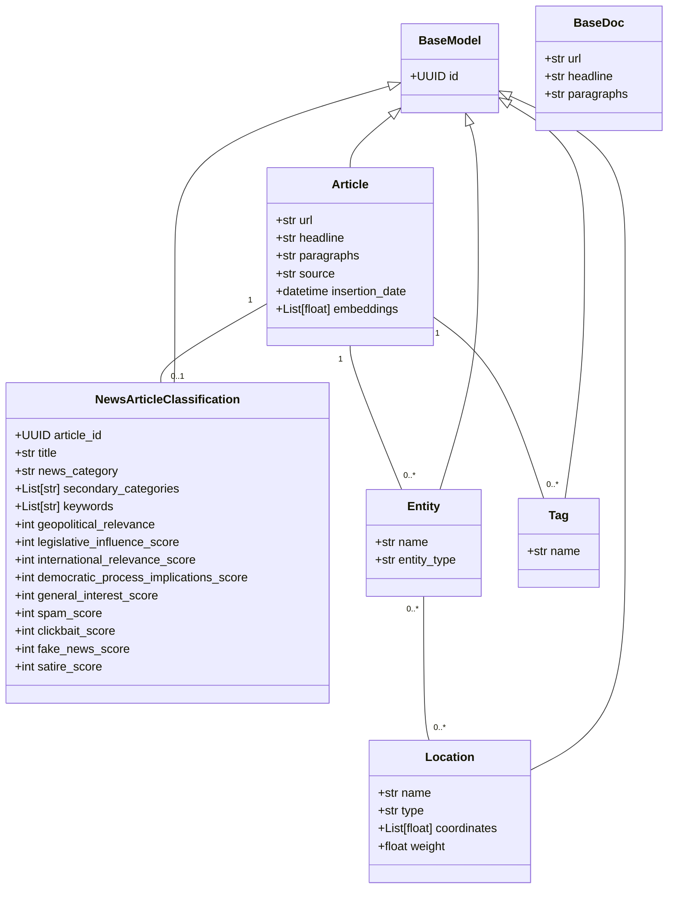

## Pydantic Data Models

This document provides an overview of the Pydantic data models used in our project. These models are essential for defining the structure of our data and ensuring data validation.

### BaseModel


### BaseDoc

The `BaseDoc` model is the base class for all documents in our system. It includes common fields such as `url`, `headline`, `paragraphs`, `source`.
This means any data that you can translate into that format can be inserted. 
More metadata fields and classes can be discussed for following versions.

```mermaid
classDiagram
